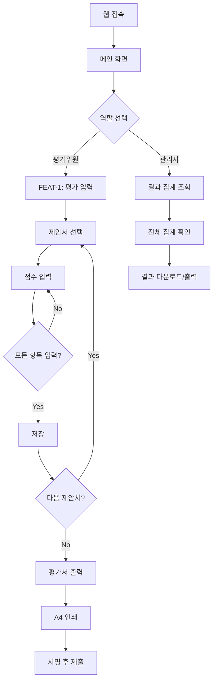
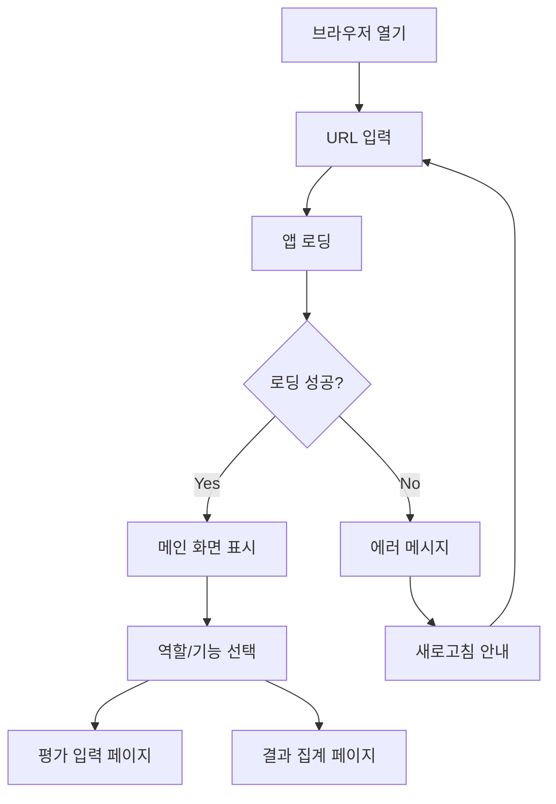
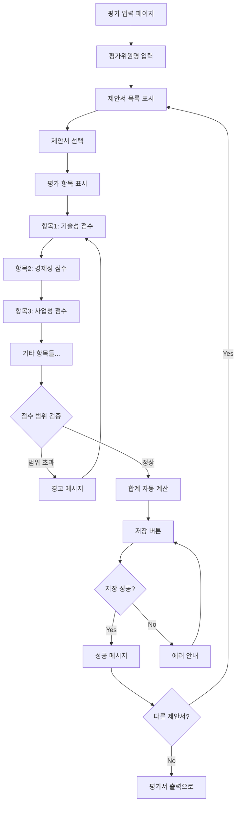
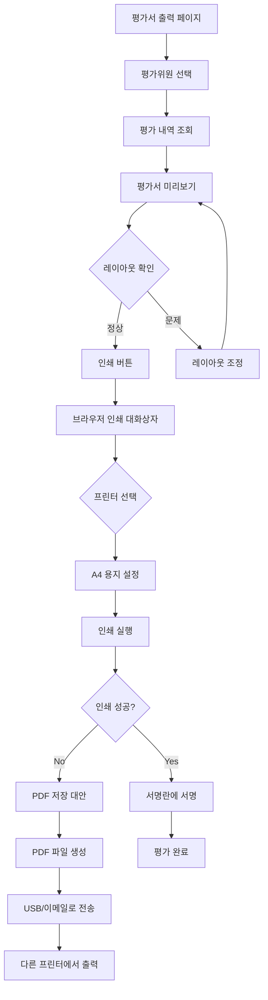
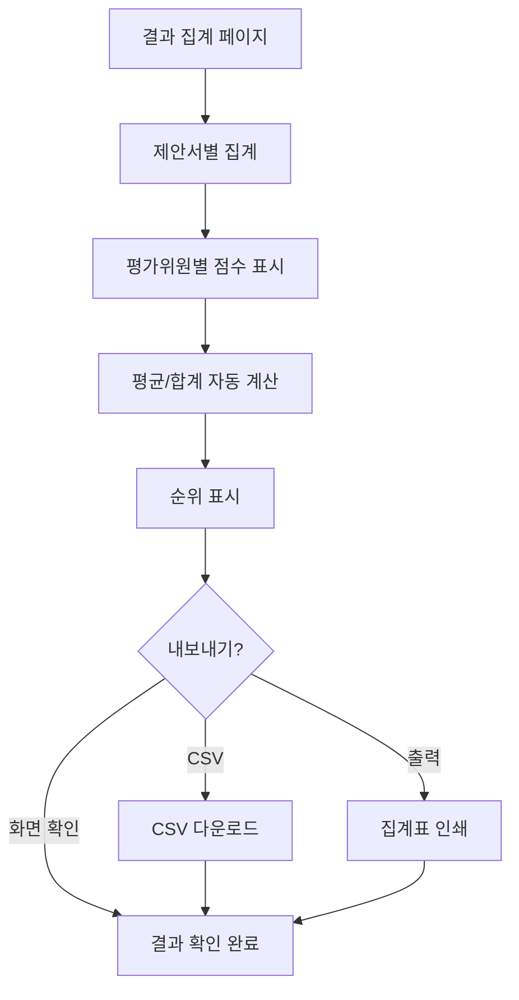
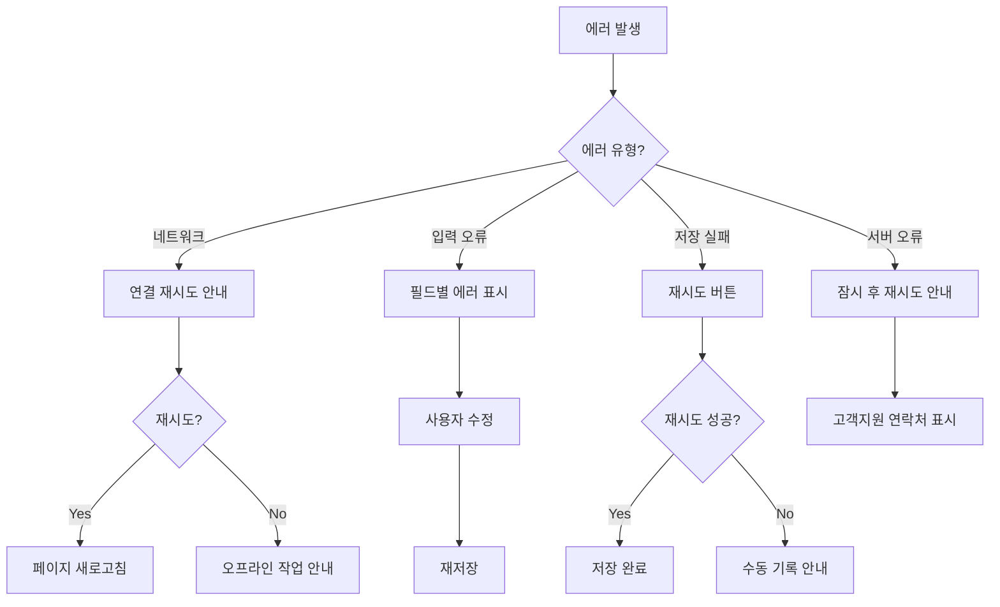
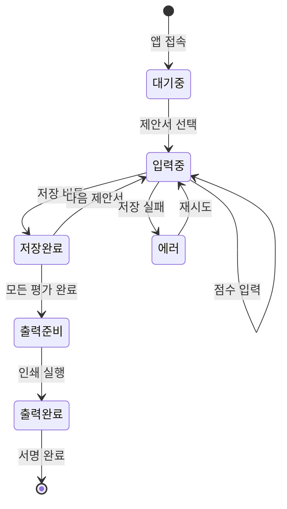

# User Flow (사용자 흐름도)

> Mermaid 플로우차트로 핵심 기능의 주요 여정을 표현합니다.

---

## MVP 캡슐

| # | 항목 | 내용 |
|---|------|------|
| 1 | 목표 | 제안서 평가 결과 자동 집계 및 평가서 출력 |
| 2 | 페르소나 | 외부 전문가 평가위원 |
| 3 | 핵심 기능 | FEAT-1: 평가 결과 자동 집계 + A4 평가서 출력 |
| 4 | 성공 지표 (노스스타) | 모든 평가서 정상 출력 |
| 5 | 입력 지표 | 평가 항목별 점수 입력 완료율 |
| 6 | 비기능 요구 | 깔끔하고 단순한 UI, 공식적 톤앤매너 |
| 7 | Out-of-scope | 로그인 시스템, 모바일 앱, 복잡한 권한 관리 |
| 8 | Top 리스크 | A4 출력 시 레이아웃 깨짐 |
| 9 | 완화/실험 | 브라우저 인쇄 기능 테스트 (CSS @print) |
| 10 | 다음 단계 | 평가 항목 구조 정의 |

---

## 1. 전체 사용자 여정 (Overview)

---

## 2. FEAT-0: 접속 플로우

---

## 3. FEAT-1: 평가 입력 플로우

---

## 4. FEAT-1: 평가서 출력 플로우

---

## 5. 결과 집계 플로우 (관리자 화면)

---

## 6. 에러 처리 플로우

---

## 7. 화면 목록 (Screen Inventory)

| 화면 ID | 화면명 | FEAT | 진입점 | 주요 액션 |
|---------|--------|------|--------|----------|
| S-01 | 메인 화면 | FEAT-0 | 앱 실행 | 기능 선택 |
| S-02 | 평가 입력 | FEAT-1 | S-01 | 평가위원명 입력, 제안서 선택 |
| S-03 | 점수 입력 | FEAT-1 | S-02 | 항목별 점수 입력, 저장 |
| S-04 | 평가서 출력 | FEAT-1 | S-02, S-03 | 미리보기, 인쇄 |
| S-05 | 결과 집계 | FEAT-1 | S-01 | 전체 집계 조회, 내보내기 |

---

## 8. 상태 전이 다이어그램

---

## Decision Log 참조

| ID | 항목 | 선택 | 근거 |
|----|------|------|------|
| D-08 | 페이지 구조 | 단일 앱, 다중 페이지 | Streamlit 페이지 기능 활용 |
| D-09 | 평가 흐름 | 제안서별 순차 입력 | 평가위원 작업 흐름에 맞춤 |
| D-10 | 출력 방식 | 브라우저 인쇄 | 별도 라이브러리 없이 가장 단순 |
