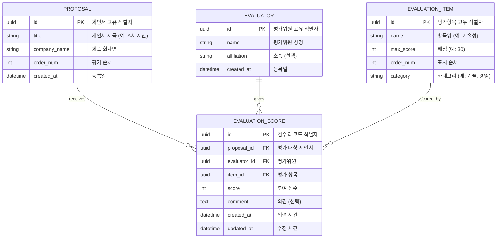

# Database Design (데이터베이스 설계)

> Mermaid ERD로 주요 엔티티와 관계를 표현합니다.
> 각 엔티티에 FEAT 주석을 달아 어떤 기능에서 사용되는지 명시합니다.

---

## MVP 캡슐

| # | 항목 | 내용 |
|---|------|------|
| 1 | 목표 | 제안서 평가 결과 자동 집계 및 평가서 출력 |
| 2 | 페르소나 | 외부 전문가 평가위원 |
| 3 | 핵심 기능 | FEAT-1: 평가 결과 자동 집계 + A4 평가서 출력 |
| 4 | 성공 지표 (노스스타) | 모든 평가서 정상 출력 |
| 5 | 입력 지표 | 평가 항목별 점수 입력 완료율 |
| 6 | 비기능 요구 | 깔끔하고 단순한 UI, 공식적 톤앤매너 |
| 7 | Out-of-scope | 로그인 시스템, 모바일 앱, 복잡한 권한 관리 |
| 8 | Top 리스크 | A4 출력 시 레이아웃 깨짐 |
| 9 | 완화/실험 | 브라우저 인쇄 기능 테스트 (CSS @print) |
| 10 | 다음 단계 | 평가 항목 구조 정의 |

---

## 1. ERD (Entity Relationship Diagram)



---

## 2. 엔티티 상세 정의

### 2.1 PROPOSAL (제안서) - FEAT-1

| 컬럼 | 타입 | 제약조건 | 설명 |
|------|------|----------|------|
| id | UUID | PK, DEFAULT uuid_generate_v4() | 고유 식별자 |
| title | VARCHAR(200) | NOT NULL | 제안서 제목 |
| company_name | VARCHAR(100) | NOT NULL | 제출 회사명 |
| order_num | INTEGER | NOT NULL, DEFAULT 0 | 평가 순서 |
| created_at | TIMESTAMP | NOT NULL, DEFAULT NOW() | 등록일 |

**인덱스:**
- `idx_proposal_order` ON order_num

### 2.2 EVALUATION_ITEM (평가항목) - FEAT-1

| 컬럼 | 타입 | 제약조건 | 설명 |
|------|------|----------|------|
| id | UUID | PK, DEFAULT uuid_generate_v4() | 고유 식별자 |
| name | VARCHAR(100) | NOT NULL | 항목명 |
| max_score | INTEGER | NOT NULL | 최대 배점 |
| order_num | INTEGER | NOT NULL, DEFAULT 0 | 표시 순서 |
| category | VARCHAR(50) | NULL | 카테고리 분류 |

**인덱스:**
- `idx_item_order` ON order_num

**예시 데이터:**
| name | max_score | category |
|------|-----------|----------|
| 기술적 우수성 | 30 | 기술 |
| 개발방법론 적절성 | 20 | 기술 |
| 사업수행 능력 | 25 | 경영 |
| 가격 적정성 | 25 | 경영 |

### 2.3 EVALUATOR (평가위원) - FEAT-1

| 컬럼 | 타입 | 제약조건 | 설명 |
|------|------|----------|------|
| id | UUID | PK, DEFAULT uuid_generate_v4() | 고유 식별자 |
| name | VARCHAR(50) | NOT NULL | 평가위원 성명 |
| affiliation | VARCHAR(100) | NULL | 소속 기관 |
| created_at | TIMESTAMP | NOT NULL, DEFAULT NOW() | 등록일 |

**최소 수집 원칙 적용:**
- 필수: 이름
- 선택: 소속
- 수집 안 함: 연락처, 이메일 (불필요)

### 2.4 EVALUATION_SCORE (평가점수) - FEAT-1 (핵심)

| 컬럼 | 타입 | 제약조건 | 설명 |
|------|------|----------|------|
| id | UUID | PK, DEFAULT uuid_generate_v4() | 고유 식별자 |
| proposal_id | UUID | FK → PROPOSAL.id, NOT NULL | 평가 대상 |
| evaluator_id | UUID | FK → EVALUATOR.id, NOT NULL | 평가위원 |
| item_id | UUID | FK → EVALUATION_ITEM.id, NOT NULL | 평가 항목 |
| score | INTEGER | NOT NULL, CHECK (score >= 0) | 부여 점수 |
| comment | TEXT | NULL | 평가 의견 |
| created_at | TIMESTAMP | NOT NULL, DEFAULT NOW() | 입력 시간 |
| updated_at | TIMESTAMP | NOT NULL, DEFAULT NOW() | 수정 시간 |

**인덱스:**
- `idx_score_proposal` ON proposal_id
- `idx_score_evaluator` ON evaluator_id
- `idx_score_unique` ON (proposal_id, evaluator_id, item_id) UNIQUE

**제약조건:**
- 동일 평가위원이 동일 제안서의 동일 항목에 중복 점수 불가

---

## 3. 관계 정의

| 부모 | 자식 | 관계 | 설명 |
|------|------|------|------|
| PROPOSAL | EVALUATION_SCORE | 1:N | 제안서는 여러 점수 레코드를 가짐 |
| EVALUATOR | EVALUATION_SCORE | 1:N | 평가위원은 여러 점수를 입력 |
| EVALUATION_ITEM | EVALUATION_SCORE | 1:N | 평가항목은 여러 점수 레코드와 연결 |

---

## 4. 집계 쿼리 예시

### 4.1 제안서별 평가위원별 총점

```sql
SELECT
    p.title AS 제안서,
    e.name AS 평가위원,
    SUM(es.score) AS 총점
FROM evaluation_score es
JOIN proposal p ON es.proposal_id = p.id
JOIN evaluator e ON es.evaluator_id = e.id
GROUP BY p.id, e.id
ORDER BY p.order_num, e.name;
```

### 4.2 제안서별 평균 점수 및 순위

```sql
SELECT
    p.title AS 제안서,
    ROUND(AVG(sub.total), 2) AS 평균점수,
    RANK() OVER (ORDER BY AVG(sub.total) DESC) AS 순위
FROM (
    SELECT
        proposal_id,
        evaluator_id,
        SUM(score) AS total
    FROM evaluation_score
    GROUP BY proposal_id, evaluator_id
) sub
JOIN proposal p ON sub.proposal_id = p.id
GROUP BY p.id
ORDER BY 순위;
```

### 4.3 항목별 점수 조회 (평가서 출력용)

```sql
SELECT
    ei.name AS 항목명,
    ei.max_score AS 배점,
    es.score AS 점수,
    es.comment AS 의견
FROM evaluation_score es
JOIN evaluation_item ei ON es.item_id = ei.id
WHERE es.proposal_id = :proposal_id
  AND es.evaluator_id = :evaluator_id
ORDER BY ei.order_num;
```

---

## 5. 데이터 생명주기

| 엔티티 | 생성 시점 | 보존 기간 | 삭제 정책 |
|--------|----------|----------|----------|
| PROPOSAL | 평가 사전 등록 | 평가 완료 후 1년 | 관리자 판단 |
| EVALUATION_ITEM | 시스템 초기화 | 영구 | 변경만 허용 |
| EVALUATOR | 평가 시작 시 | 평가 기간 | 평가 종료 후 삭제 가능 |
| EVALUATION_SCORE | 점수 입력 시 | 제안서와 동일 | Cascade delete |

---

## 6. Supabase 테이블 생성 SQL

```sql
-- UUID 확장 활성화
CREATE EXTENSION IF NOT EXISTS "uuid-ossp";

-- 제안서 테이블
CREATE TABLE proposal (
    id UUID PRIMARY KEY DEFAULT uuid_generate_v4(),
    title VARCHAR(200) NOT NULL,
    company_name VARCHAR(100) NOT NULL,
    order_num INTEGER NOT NULL DEFAULT 0,
    created_at TIMESTAMP NOT NULL DEFAULT NOW()
);

-- 평가항목 테이블
CREATE TABLE evaluation_item (
    id UUID PRIMARY KEY DEFAULT uuid_generate_v4(),
    name VARCHAR(100) NOT NULL,
    max_score INTEGER NOT NULL,
    order_num INTEGER NOT NULL DEFAULT 0,
    category VARCHAR(50)
);

-- 평가위원 테이블
CREATE TABLE evaluator (
    id UUID PRIMARY KEY DEFAULT uuid_generate_v4(),
    name VARCHAR(50) NOT NULL,
    affiliation VARCHAR(100),
    created_at TIMESTAMP NOT NULL DEFAULT NOW()
);

-- 평가점수 테이블 (핵심)
CREATE TABLE evaluation_score (
    id UUID PRIMARY KEY DEFAULT uuid_generate_v4(),
    proposal_id UUID NOT NULL REFERENCES proposal(id) ON DELETE CASCADE,
    evaluator_id UUID NOT NULL REFERENCES evaluator(id) ON DELETE CASCADE,
    item_id UUID NOT NULL REFERENCES evaluation_item(id) ON DELETE CASCADE,
    score INTEGER NOT NULL CHECK (score >= 0),
    comment TEXT,
    created_at TIMESTAMP NOT NULL DEFAULT NOW(),
    updated_at TIMESTAMP NOT NULL DEFAULT NOW(),
    UNIQUE (proposal_id, evaluator_id, item_id)
);

-- 인덱스 생성
CREATE INDEX idx_proposal_order ON proposal(order_num);
CREATE INDEX idx_item_order ON evaluation_item(order_num);
CREATE INDEX idx_score_proposal ON evaluation_score(proposal_id);
CREATE INDEX idx_score_evaluator ON evaluation_score(evaluator_id);
```

---

## 7. 초기 데이터 예시

```sql
-- 평가항목 초기 데이터
INSERT INTO evaluation_item (name, max_score, order_num, category) VALUES
('기술적 우수성', 30, 1, '기술'),
('개발방법론 적절성', 20, 2, '기술'),
('사업수행 능력', 25, 3, '경영'),
('가격 적정성', 25, 4, '경영');

-- 제안서 예시 데이터
INSERT INTO proposal (title, company_name, order_num) VALUES
('A사 제안', 'A 주식회사', 1),
('B사 제안', 'B 주식회사', 2),
('C사 제안', 'C 주식회사', 3);
```

---

## Decision Log 참조

| ID | 항목 | 선택 | 근거 |
|----|------|------|------|
| D-11 | PK 타입 | UUID | Supabase 기본, 분산 환경 대응 |
| D-12 | 점수 저장 | 항목별 개별 저장 | 유연한 집계, 항목 추가 용이 |
| D-13 | 중복 방지 | UNIQUE 제약 | 동일 항목 중복 입력 방지 |
