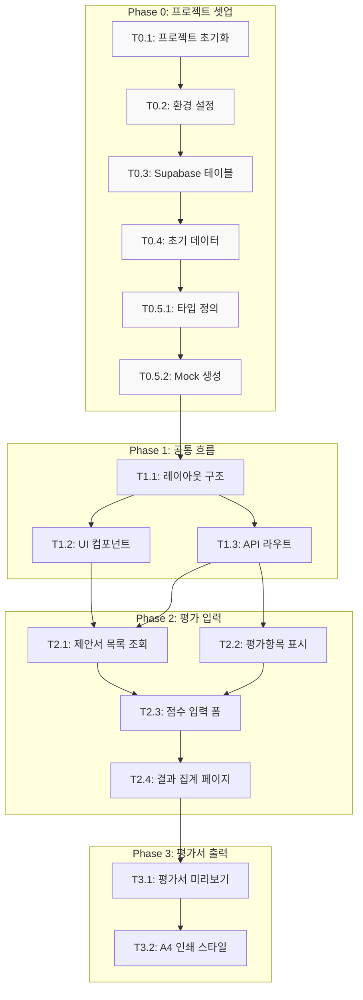

# TASKS: 제안평가시스템

> AI 코딩 파트너(오케스트레이터/서브에이전트)용 태스크 목록
> TDD 워크플로우, Git Worktree, Phase 규칙 적용

---

## MVP 캡슐

| # | 항목 | 내용 |
|---|------|------|
| 1 | 목표 | 제안서 평가 결과 자동 집계 및 평가서 출력 |
| 2 | 페르소나 | 외부 전문가 평가위원 |
| 3 | 핵심 기능 | FEAT-1: 평가 결과 자동 집계 + A4 평가서 출력 |
| 4 | 성공 지표 (노스스타) | 모든 평가서 정상 출력 |
| 5 | 입력 지표 | 평가 항목별 점수 입력 완료율 |
| 6 | 비기능 요구 | 깔끔하고 단순한 UI, 공식적 톤앤매너 |
| 7 | Out-of-scope | 로그인 시스템, 모바일 앱, 복잡한 권한 관리 |
| 8 | Top 리스크 | A4 출력 시 레이아웃 깨짐 |
| 9 | 완화/실험 | 브라우저 인쇄 기능 테스트 (CSS @print) |
| 10 | 다음 단계 | 평가 항목 구조 정의 |

---

## 기술 스택

| 영역 | 기술 |
|------|------|
| 프레임워크 | Next.js 14+ (App Router) |
| 언어 | TypeScript 5+ |
| 스타일링 | Tailwind CSS 3+ |
| 데이터베이스 | Supabase (PostgreSQL) |
| 호스팅 | Vercel |
| 테스트 | Vitest + Testing Library |

---

## 마일스톤 개요

| 마일스톤 | Phase | 설명 | 상태 |
|----------|-------|------|------|
| M0 | Phase 0 | 프로젝트 셋업 | ✅ |
| M0.5 | Phase 0 | 타입 정의 & 테스트 설계 | ✅ |
| M1 | Phase 1 | FEAT-0: 공통 흐름 (접속/홈) | ✅ |
| M2 | Phase 2 | FEAT-1: 평가 입력 + 자동 집계 | ✅ |
| M3 | Phase 3 | FEAT-1: 평가서 출력 (A4) | ✅ |

---

## 병렬 실행 가능 태스크

| Phase | 병렬 가능 태스크 | 설명 |
|-------|-----------------|------|
| Phase 0 | T0.1, T0.2 | 프로젝트 구조와 환경 설정 동시 진행 |
| Phase 0 | T0.3, T0.4 | Supabase 설정과 초기 데이터 동시 진행 |
| Phase 1 | T1.2, T1.3 | UI 컴포넌트와 API 라우트 병렬 개발 |
| Phase 2 | T2.1, T2.2 | 제안서/평가항목 기능 병렬 개발 (Mock 활용) |

---

## 의존성 그래프



---

## M0: 프로젝트 셋업

### [x] Phase 0, T0.1: 프로젝트 초기화

**담당**: frontend-specialist

**작업 내용**:
- Next.js 14+ 프로젝트 생성 (App Router)
- TypeScript, Tailwind CSS 설정
- ESLint, Prettier 설정

**실행 명령**:
```bash
npx create-next-app@latest proposal-evaluation --typescript --tailwind --eslint --app --src-dir=false --import-alias="@/*"
cd proposal-evaluation
```

**산출물**:
```
proposal-evaluation/
├── app/
│   ├── layout.tsx
│   ├── page.tsx
│   └── globals.css
├── components/
├── lib/
├── types/
├── public/
├── package.json
├── tsconfig.json
├── tailwind.config.ts
├── next.config.js
└── .gitignore
```

**완료 조건**:
- [ ] `npm run dev` 성공
- [ ] `npm run build` 성공
- [ ] TypeScript 에러 없음

---

### [x] Phase 0, T0.2: 환경 설정 및 의존성

**담당**: frontend-specialist

**작업 내용**:
- Supabase 클라이언트 설치
- Zod 설치 (입력 검증)
- Vitest 설치 (테스트)
- `.env.example` 생성

**실행 명령**:
```bash
npm install @supabase/supabase-js zod
npm install -D vitest @vitejs/plugin-react @testing-library/react @testing-library/jest-dom jsdom
```

**산출물**:
- `package.json` (의존성 추가)
- `.env.example`
- `vitest.config.ts`

**.env.example**:
```bash
NEXT_PUBLIC_SUPABASE_URL=https://xxxxx.supabase.co
NEXT_PUBLIC_SUPABASE_ANON_KEY=your-anon-key-here
```

**vitest.config.ts**:
```typescript
import { defineConfig } from 'vitest/config';
import react from '@vitejs/plugin-react';
import path from 'path';

export default defineConfig({
  plugins: [react()],
  test: {
    environment: 'jsdom',
    globals: true,
    setupFiles: ['./tests/setup.ts'],
  },
  resolve: {
    alias: {
      '@': path.resolve(__dirname, './'),
    },
  },
});
```

**완료 조건**:
- [ ] `npm install` 성공
- [ ] `.env.example` 작성 완료
- [ ] `npx vitest --run` 실행 가능

---

### [x] Phase 0, T0.3: Supabase 테이블 생성

**담당**: database-specialist

**작업 내용**:
- Supabase 프로젝트에 테이블 생성
- 04-database-design.md의 SQL 실행

**산출물**:
- `scripts/create_tables.sql` (백업용)

**테이블 목록**:
| 테이블명 | 설명 |
|----------|------|
| proposal | 제안서 정보 |
| evaluation_item | 평가 항목 |
| evaluator | 평가위원 |
| evaluation_score | 평가 점수 |

**완료 조건**:
- [ ] 4개 테이블 생성 완료
- [ ] 인덱스 생성 완료
- [ ] Supabase 대시보드에서 확인

---

### [x] Phase 0, T0.4: 초기 데이터 삽입

**담당**: database-specialist

**작업 내용**:
- 평가항목 초기 데이터 삽입
- 테스트용 제안서 데이터 삽입

**산출물**:
- `scripts/seed_data.sql`

**초기 데이터**:
```sql
-- 평가항목
INSERT INTO evaluation_item (name, max_score, order_num, category) VALUES
('기술적 우수성', 30, 1, '기술'),
('개발방법론 적절성', 20, 2, '기술'),
('사업수행 능력', 25, 3, '경영'),
('가격 적정성', 25, 4, '경영');

-- 테스트용 제안서
INSERT INTO proposal (name, order_num) VALUES
('A사 제안', 1),
('B사 제안', 2),
('C사 제안', 3);
```

**완료 조건**:
- [ ] 평가항목 4개 삽입 완료
- [ ] 테스트 제안서 3개 삽입 완료

---

## M0.5: 타입 정의 & 테스트 설계

### [x] Phase 0, T0.5.1: TypeScript 타입 정의

**담당**: backend-specialist

**작업 내용**:
- Supabase 데이터베이스 타입 정의
- API 응답 타입 정의
- 공통 타입 정의

**산출물**:
- `types/database.ts`
- `types/index.ts`

**타입 정의**:
```typescript
// types/database.ts
export interface Database {
  public: {
    Tables: {
      proposal: {
        Row: {
          id: string;
          name: string;
          order_num: number;
          created_at: string;
        };
        Insert: Omit<Proposal, 'id' | 'created_at'>;
        Update: Partial<Proposal>;
      };
      evaluator: {
        Row: {
          id: string;
          name: string;
          created_at: string;
        };
        Insert: Omit<Evaluator, 'id' | 'created_at'>;
        Update: Partial<Evaluator>;
      };
      evaluation_item: {
        Row: {
          id: string;
          name: string;
          max_score: number;
          category: string;
          order_num: number;
        };
        Insert: Omit<EvaluationItem, 'id'>;
        Update: Partial<EvaluationItem>;
      };
      evaluation_score: {
        Row: {
          id: string;
          proposal_id: string;
          evaluator_id: string;
          item_id: string;
          score: number;
          created_at: string;
        };
        Insert: Omit<EvaluationScore, 'id' | 'created_at'>;
        Update: Partial<EvaluationScore>;
      };
    };
  };
}

export type Proposal = Database['public']['Tables']['proposal']['Row'];
export type Evaluator = Database['public']['Tables']['evaluator']['Row'];
export type EvaluationItem = Database['public']['Tables']['evaluation_item']['Row'];
export type EvaluationScore = Database['public']['Tables']['evaluation_score']['Row'];
```

```typescript
// types/index.ts
export interface ApiResponse<T> {
  data: T;
  error: null;
}

export interface ApiErrorResponse {
  data: null;
  error: {
    message: string;
    code: string;
  };
}

export type ApiResult<T> = ApiResponse<T> | ApiErrorResponse;
```

**완료 조건**:
- [ ] 모든 데이터 타입 정의 완료
- [ ] TypeScript 에러 없음

---

### [x] Phase 0, T0.5.2: Mock 생성 및 테스트 설정

**담당**: test-specialist

**작업 내용**:
- Mock 데이터 생성
- 테스트 설정 파일 생성
- 기본 테스트 구조 설정

**산출물**:
- `tests/setup.ts`
- `tests/mocks/index.ts`

**Mock 예시**:
```typescript
// tests/mocks/index.ts
import type { Proposal, EvaluationItem, Evaluator, EvaluationScore } from '@/types/database';

export const MOCK_PROPOSALS: Proposal[] = [
  { id: '1', name: 'A사 제안', order_num: 1, created_at: '2024-01-01' },
  { id: '2', name: 'B사 제안', order_num: 2, created_at: '2024-01-01' },
  { id: '3', name: 'C사 제안', order_num: 3, created_at: '2024-01-01' },
];

export const MOCK_ITEMS: EvaluationItem[] = [
  { id: '1', name: '기술적 우수성', max_score: 30, order_num: 1, category: '기술' },
  { id: '2', name: '개발방법론 적절성', max_score: 20, order_num: 2, category: '기술' },
  { id: '3', name: '사업수행 능력', max_score: 25, order_num: 3, category: '경영' },
  { id: '4', name: '가격 적정성', max_score: 25, order_num: 4, category: '경영' },
];

export const MOCK_EVALUATORS: Evaluator[] = [
  { id: '1', name: '홍길동', created_at: '2024-01-01' },
  { id: '2', name: '김철수', created_at: '2024-01-01' },
];
```

**테스트 설정**:
```typescript
// tests/setup.ts
import '@testing-library/jest-dom';
```

**완료 조건**:
- [ ] `tests/` 폴더 구조 생성
- [ ] Mock 데이터 생성 완료
- [ ] `npx vitest --run` 성공

---

## M1: FEAT-0 공통 흐름

### [x] Phase 1, T1.1: 레이아웃 구조

**담당**: frontend-specialist

**Git Worktree 설정**:
```bash
git worktree add ../proposal-eval-phase1-layout -b phase/1-layout
cd ../proposal-eval-phase1-layout
```

**작업 내용**:
- 루트 레이아웃 구현
- 네비게이션 컴포넌트 구현
- 공통 스타일 설정

**산출물**:
- `app/layout.tsx`
- `components/Navigation.tsx`
- `app/globals.css`

**레이아웃 구현**:
```typescript
// app/layout.tsx
import type { Metadata } from 'next';
import { Navigation } from '@/components/Navigation';
import './globals.css';

export const metadata: Metadata = {
  title: '제안평가시스템',
  description: '제안서 평가 결과 자동 집계 및 평가서 출력',
};

export default function RootLayout({
  children,
}: {
  children: React.ReactNode;
}) {
  return (
    <html lang="ko">
      <body className="min-h-screen bg-gray-50">
        <Navigation />
        <main className="container mx-auto px-4 py-8">
          {children}
        </main>
      </body>
    </html>
  );
}
```

**완료 조건**:
- [ ] 레이아웃 렌더링 성공
- [ ] 네비게이션 표시
- [ ] 반응형 디자인 확인

---

### [x] Phase 1, T1.2: 공통 UI 컴포넌트

**담당**: frontend-specialist

**작업 내용**:
- Button 컴포넌트
- Input 컴포넌트
- Card 컴포넌트
- Table 컴포넌트
- Alert 컴포넌트

**산출물**:
- `components/ui/Button.tsx`
- `components/ui/Input.tsx`
- `components/ui/Card.tsx`
- `components/ui/Table.tsx`
- `components/ui/Alert.tsx`

**테스트 코드**:
```typescript
// tests/components/Button.test.tsx
import { render, screen, fireEvent } from '@testing-library/react';
import { describe, it, expect, vi } from 'vitest';
import { Button } from '@/components/ui/Button';

describe('Button', () => {
  it('renders with text', () => {
    render(<Button>Click me</Button>);
    expect(screen.getByText('Click me')).toBeInTheDocument();
  });

  it('calls onClick when clicked', () => {
    const handleClick = vi.fn();
    render(<Button onClick={handleClick}>Click me</Button>);
    fireEvent.click(screen.getByText('Click me'));
    expect(handleClick).toHaveBeenCalledTimes(1);
  });

  it('is disabled when disabled prop is true', () => {
    render(<Button disabled>Disabled</Button>);
    expect(screen.getByText('Disabled')).toBeDisabled();
  });
});
```

**완료 조건**:
- [ ] 테스트 먼저 작성됨 (RED 확인)
- [ ] 모든 테스트 통과 (GREEN)
- [ ] 5개 컴포넌트 구현 완료

---

### [x] Phase 1, T1.3: API 라우트 기본 구조

**담당**: backend-specialist

**작업 내용**:
- Supabase 클라이언트 설정
- API 라우트 기본 구조 생성
- 에러 핸들링 유틸리티

**산출물**:
- `lib/supabase.ts`
- `lib/utils.ts`
- `app/api/proposals/route.ts`
- `app/api/evaluators/route.ts`
- `app/api/evaluation-items/route.ts`
- `app/api/scores/route.ts`

**Supabase 클라이언트**:
```typescript
// lib/supabase.ts
import { createClient } from '@supabase/supabase-js';
import type { Database } from '@/types/database';

const supabaseUrl = process.env.NEXT_PUBLIC_SUPABASE_URL!;
const supabaseKey = process.env.NEXT_PUBLIC_SUPABASE_ANON_KEY!;

export const supabase = createClient<Database>(supabaseUrl, supabaseKey);
```

**완료 조건**:
- [ ] Supabase 클라이언트 연결 성공
- [ ] API 라우트 기본 구조 완료
- [ ] 에러 핸들링 동작 확인

---

## M2: FEAT-1 평가 입력 + 자동 집계

### [x] Phase 2, T2.1: 제안서 목록 조회

**담당**: backend-specialist

**Git Worktree 설정**:
```bash
git worktree add ../proposal-eval-phase2-proposals -b phase/2-proposals
cd ../proposal-eval-phase2-proposals
```

**TDD 사이클**:

1. **RED**: 테스트 작성
   ```bash
   npx vitest tests/api/proposals.test.ts --run  # Expected: FAILED
   ```

2. **GREEN**: 최소 구현
   ```bash
   npx vitest tests/api/proposals.test.ts --run  # Expected: PASSED
   ```

**테스트 코드**:
```typescript
// tests/api/proposals.test.ts
import { describe, it, expect, vi } from 'vitest';
import { GET } from '@/app/api/proposals/route';
import { MOCK_PROPOSALS } from '@/tests/mocks';

vi.mock('@/lib/supabase', () => ({
  supabase: {
    from: vi.fn().mockReturnValue({
      select: vi.fn().mockReturnValue({
        order: vi.fn().mockResolvedValue({ data: MOCK_PROPOSALS, error: null }),
      }),
    }),
  },
}));

describe('GET /api/proposals', () => {
  it('returns proposals list', async () => {
    const response = await GET();
    const data = await response.json();

    expect(response.status).toBe(200);
    expect(data.data).toHaveLength(3);
    expect(data.data[0].name).toBe('A사 제안');
  });
});
```

**산출물**:
- `tests/api/proposals.test.ts`
- `app/api/proposals/route.ts`

**완료 조건**:
- [ ] 테스트 먼저 작성됨 (RED 확인)
- [ ] 모든 테스트 통과 (GREEN)
- [ ] 제안서 목록 정렬 (order_num 기준)

---

### [x] Phase 2, T2.2: 평가항목 표시

**담당**: backend-specialist

**TDD 사이클**:

1. **RED**: 테스트 작성
2. **GREEN**: 최소 구현

**테스트 코드**:
```typescript
// tests/api/evaluation-items.test.ts
import { describe, it, expect, vi } from 'vitest';
import { GET } from '@/app/api/evaluation-items/route';
import { MOCK_ITEMS } from '@/tests/mocks';

vi.mock('@/lib/supabase', () => ({
  supabase: {
    from: vi.fn().mockReturnValue({
      select: vi.fn().mockReturnValue({
        order: vi.fn().mockResolvedValue({ data: MOCK_ITEMS, error: null }),
      }),
    }),
  },
}));

describe('GET /api/evaluation-items', () => {
  it('returns ordered evaluation items', async () => {
    const response = await GET();
    const data = await response.json();

    expect(response.status).toBe(200);
    expect(data.data).toHaveLength(4);
    expect(data.data[0].order_num).toBeLessThanOrEqual(data.data[1].order_num);
  });
});
```

**산출물**:
- `tests/api/evaluation-items.test.ts`
- `app/api/evaluation-items/route.ts`

---

### [x] Phase 2, T2.3: 점수 입력 폼

**담당**: frontend-specialist

**TDD 사이클**:

1. **RED**: 테스트 작성
2. **GREEN**: 최소 구현

**테스트 코드**:
```typescript
// tests/components/ScoreInput.test.tsx
import { render, screen, fireEvent } from '@testing-library/react';
import { describe, it, expect, vi } from 'vitest';
import { ScoreInput } from '@/components/evaluation/ScoreInput';

describe('ScoreInput', () => {
  const mockItem = { id: '1', name: '기술적 우수성', max_score: 30, order_num: 1, category: '기술' };

  it('validates score is within range', () => {
    const onChange = vi.fn();
    render(<ScoreInput item={mockItem} value={0} onChange={onChange} />);

    const input = screen.getByRole('spinbutton');
    fireEvent.change(input, { target: { value: '25' } });

    expect(onChange).toHaveBeenCalledWith(25);
  });

  it('shows error for score exceeding max', () => {
    const onChange = vi.fn();
    render(<ScoreInput item={mockItem} value={0} onChange={onChange} />);

    const input = screen.getByRole('spinbutton');
    fireEvent.change(input, { target: { value: '35' } });

    expect(screen.getByText(/범위/)).toBeInTheDocument();
  });
});
```

```typescript
// tests/lib/calculations.test.ts
import { describe, it, expect } from 'vitest';
import { calculateTotal, validateScore } from '@/lib/calculations';

describe('calculateTotal', () => {
  it('sums all scores', () => {
    const scores = [25, 18, 20, 22];
    expect(calculateTotal(scores)).toBe(85);
  });

  it('returns 0 for empty array', () => {
    expect(calculateTotal([])).toBe(0);
  });
});

describe('validateScore', () => {
  it('returns true for valid score', () => {
    const result = validateScore(25, 30);
    expect(result.isValid).toBe(true);
  });

  it('returns false for score exceeding max', () => {
    const result = validateScore(35, 30);
    expect(result.isValid).toBe(false);
    expect(result.message).toContain('초과');
  });

  it('returns false for negative score', () => {
    const result = validateScore(-5, 30);
    expect(result.isValid).toBe(false);
  });
});
```

**산출물**:
- `tests/components/ScoreInput.test.tsx`
- `tests/lib/calculations.test.ts`
- `components/evaluation/ScoreInput.tsx`
- `lib/calculations.ts`
- `app/evaluation/page.tsx`

**완료 조건**:
- [ ] 테스트 먼저 작성됨 (RED 확인)
- [ ] 모든 테스트 통과 (GREEN)
- [ ] 점수 입력 시 실시간 합계 표시
- [ ] 범위 초과 시 경고 표시

---

### [x] Phase 2, T2.4: 결과 집계 페이지

**담당**: frontend-specialist

**TDD 사이클**:

1. **RED**: 테스트 작성
2. **GREEN**: 최소 구현

**테스트 코드**:
```typescript
// tests/lib/aggregation.test.ts
import { describe, it, expect } from 'vitest';
import { calculateAverage, calculateRanking } from '@/lib/aggregation';

describe('calculateAverage', () => {
  it('calculates average to 2 decimal places', () => {
    const scores = [85, 90, 78];
    expect(calculateAverage(scores)).toBe(84.33);
  });

  it('returns 0 for empty array', () => {
    expect(calculateAverage([])).toBe(0);
  });
});

describe('calculateRanking', () => {
  it('ranks proposals by average score descending', () => {
    const proposals = [
      { name: 'A사', average: 85 },
      { name: 'B사', average: 90 },
      { name: 'C사', average: 78 },
    ];
    const ranked = calculateRanking(proposals);

    expect(ranked[0].name).toBe('B사');
    expect(ranked[0].rank).toBe(1);
    expect(ranked[1].name).toBe('A사');
    expect(ranked[1].rank).toBe(2);
  });
});
```

**산출물**:
- `tests/lib/aggregation.test.ts`
- `lib/aggregation.ts`
- `app/results/page.tsx`
- `components/evaluation/ResultTable.tsx`

**완료 조건**:
- [ ] 테스트 먼저 작성됨 (RED 확인)
- [ ] 모든 테스트 통과 (GREEN)
- [ ] 제안서별 평균 점수 표시
- [ ] 순위 자동 계산

---

## M3: FEAT-1 평가서 출력

### [x] Phase 3, T3.1: 평가서 미리보기

**담당**: frontend-specialist

**TDD 사이클**:

1. **RED**: 테스트 작성
2. **GREEN**: 최소 구현

**테스트 코드**:
```typescript
// tests/lib/report.test.ts
import { describe, it, expect } from 'vitest';
import { generateReportData } from '@/lib/report';

describe('generateReportData', () => {
  it('generates report data with total', () => {
    const scores = [
      { itemName: '기술적 우수성', maxScore: 30, score: 25 },
      { itemName: '개발방법론', maxScore: 20, score: 18 },
    ];
    const report = generateReportData({
      evaluatorName: '홍길동',
      proposalName: 'A사 제안',
      scores,
    });

    expect(report.evaluator).toBe('홍길동');
    expect(report.proposal).toBe('A사 제안');
    expect(report.total).toBe(43);
    expect(report.items).toHaveLength(2);
  });
});
```

**산출물**:
- `tests/lib/report.test.ts`
- `lib/report.ts`
- `app/print/page.tsx`
- `components/print/EvaluationSheet.tsx`

**완료 조건**:
- [ ] 테스트 먼저 작성됨 (RED 확인)
- [ ] 모든 테스트 통과 (GREEN)
- [ ] 평가서 미리보기 화면 표시
- [ ] 평가위원명, 제안서명, 점수 표시

---

### [x] Phase 3, T3.2: A4 인쇄 스타일

**담당**: frontend-specialist

**작업 내용**:
- 인쇄용 CSS 작성 (@media print)
- A4 페이지 설정
- Tailwind print: 변형 적용

**산출물**:
- `styles/print.css`
- `components/print/PrintButton.tsx`

**인쇄 스타일**:
```css
/* styles/print.css */
@media print {
  @page {
    size: A4;
    margin: 20mm;
  }

  body {
    print-color-adjust: exact;
    -webkit-print-color-adjust: exact;
  }

  /* 화면 전용 요소 숨김 */
  .no-print,
  nav,
  .print-button {
    display: none !important;
  }

  /* 페이지 나눔 방지 */
  .evaluation-sheet {
    page-break-inside: avoid;
  }

  /* 서명란 */
  .signature-area {
    border-top: 1px solid #000;
    margin-top: 40mm;
    padding-top: 5mm;
  }
}
```

**완료 조건**:
- [ ] A4 용지 크기 설정 (@page)
- [ ] 네비게이션 숨김 처리
- [ ] 서명란 포함
- [ ] 브라우저 인쇄 대화상자 열기
- [ ] 실제 인쇄 테스트 완료

---

## 품질 게이트

### 태스크 완료 기준

| 기준 | 설명 |
|------|------|
| 테스트 통과 | 모든 Vitest 테스트 PASSED |
| 타입 체크 | `npm run type-check` 에러 없음 |
| 린트 통과 | `npm run lint` 에러 없음 |
| 빌드 성공 | `npm run build` 성공 |
| 코드 리뷰 | 사용자 승인 |

### 최종 검증

```bash
# 전체 테스트 실행
npm run test

# 타입 체크
npm run type-check

# 린트 실행
npm run lint

# 빌드 확인
npm run build

# 개발 서버 실행
npm run dev
```

---

## 다음 우선순위 작업

1. **T0.1, T0.2**: 프로젝트 초기화 및 환경 설정 (병렬 가능)
2. **T0.3, T0.4**: Supabase 테이블 및 초기 데이터
3. **T0.5.1, T0.5.2**: 타입 정의 및 Mock 생성
4. **T1.1, T1.2, T1.3**: 레이아웃, UI 컴포넌트, API 라우트 (병렬 가능)
5. **T2.x**: 평가 입력 기능 구현
6. **T3.x**: 평가서 출력 기능 구현
